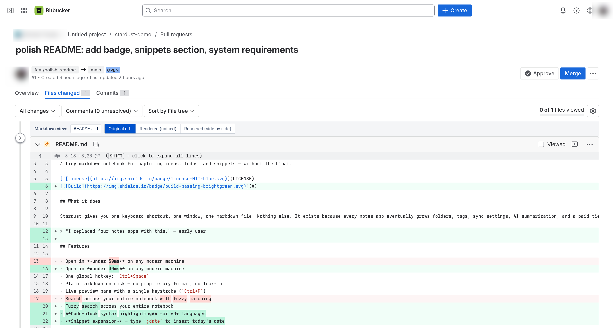
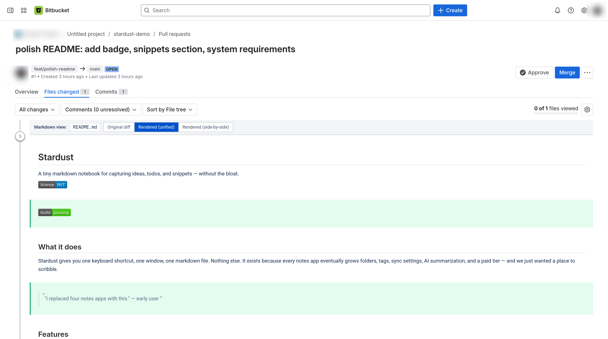
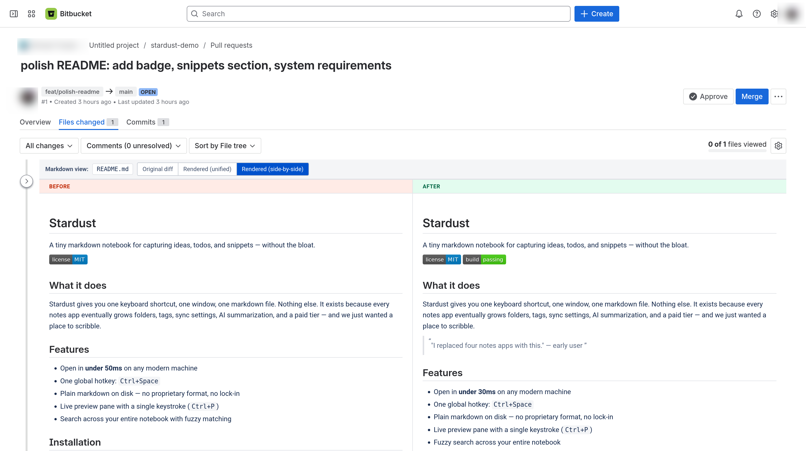

# Bitbucket Rich Diffs

A Firefox extension that renders Markdown files in Bitbucket Cloud pull-request diffs as proper formatted documents — unified or side-by-side — so reviewing prose, READMEs, and design docs stops feeling like reading a `+`/`-` log.

## See it in action

Each markdown file in a PR diff gets its own toolbar with three view modes you can switch between freely.

**Original diff** — Bitbucket's default view, untouched:



**Rendered (unified)** — the file rendered as actual Markdown, with added blocks tinted green and removed blocks tinted red and struck through, in document order:



**Rendered (side-by-side)** — two columns: Before on the left, After on the right, both fully rendered:



## Install

**From AMO** (recommended once approved):
[Bitbucket Rich Diffs on addons.mozilla.org](https://addons.mozilla.org/en-US/firefox/addon/bitbucket-markdown-diff-render/)

**Or load temporarily for development**:
1. Open Firefox → `about:debugging#/runtime/this-firefox`
2. Click **Load Temporary Add-on…** → pick `manifest.json` in this repo
3. Open any Bitbucket Cloud PR that touches a `.md` file

Temporary add-ons clear on Firefox restart. The published AMO build persists.

## How it works

1. Content script runs on `*://bitbucket.org/*/pull-requests/*` pages.
2. It detects each file card on the diff page by looking for Bitbucket's per-file "Viewed" label, then finds the nearest enclosing card that contains diff hunks.
3. Filters to markdown filenames (`.md`, `.markdown`, `.mdx`, `.mkd`) and injects a toolbar.
4. On mode switch, it resolves the PR's source/destination commit hashes (via the same Bitbucket session you're already signed in with) and fetches the raw before/after content from `/raw/{commit}/{path}`.
5. Renders with [`marked`](https://github.com/markedjs/marked), sanitizes with [`DOMPurify`](https://github.com/cure53/DOMPurify), and computes a line-level diff with [`jsdiff`](https://github.com/kpdecker/jsdiff) for the unified-rendered view.

No data leaves your browser other than the file fetches that go to Bitbucket directly. No tracking, no analytics, no separate authentication.

## Files

```
manifest.json       MV3 manifest (Firefox)
amo-metadata.json   Listing metadata used by the release pipeline
src/content.js      Page detection, toolbar, fetch, mode switching
src/renderer.js     Markdown + diff rendering helpers
src/background.js   Privileged fetch handler for cross-origin requests
src/styles.css      Toolbar + rendered output styling
lib/marked.min.js   Markdown parser (MIT, vendored)
lib/diff.min.js     Line-level diff (BSD-3, vendored, jsdiff)
lib/purify.min.js   HTML sanitizer (Apache-2.0/MPL-2.0, vendored, DOMPurify)
icons/              Extension icons
screens/            Screenshots used in this README and the AMO listing
```

## Releases

Tagging `v*` triggers a GitHub Actions workflow that lints with `web-ext`, builds a signed source zip, submits to AMO via `web-ext sign --channel=listed`, and creates a GitHub release with the zip attached. See [`RELEASING.md`](RELEASING.md).

## Known limitations

- Side-by-side renders the two columns independently rather than line-aligned — aligning rendered HTML to source lines reliably is more trouble than it's worth.
- The unified view renders each diff hunk separately, so a list item or fenced code block split across hunks may render slightly differently than the full document would.
- Only Markdown files are supported today. More file formats (CSV, ODS, JSON tree, etc.) are planned.

## License

MIT — see [`LICENSE`](LICENSE).
