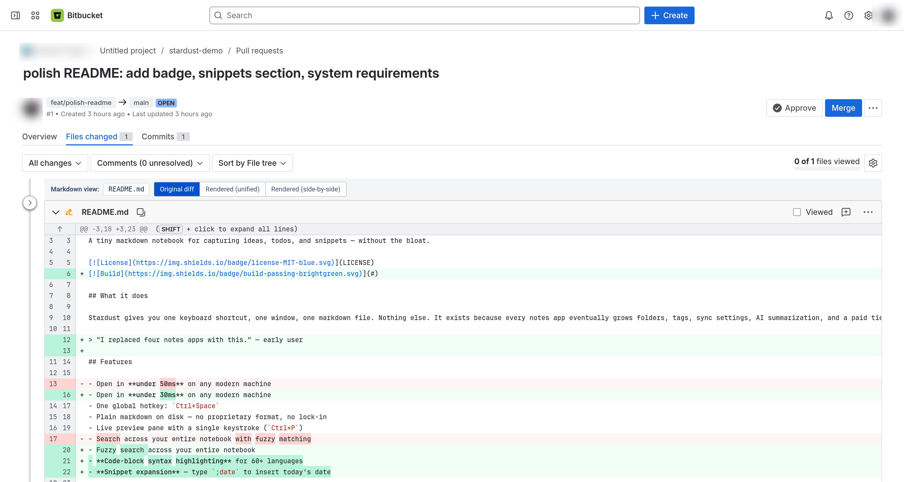
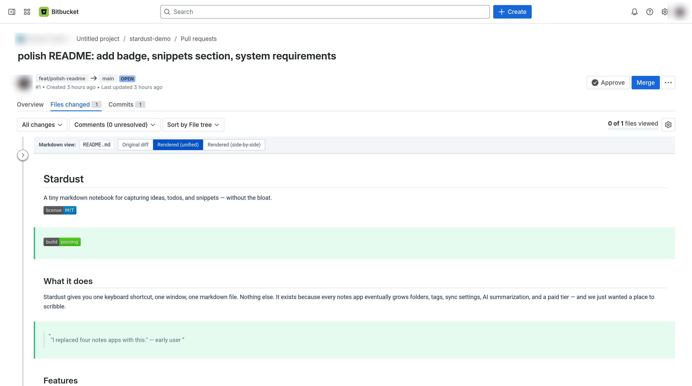
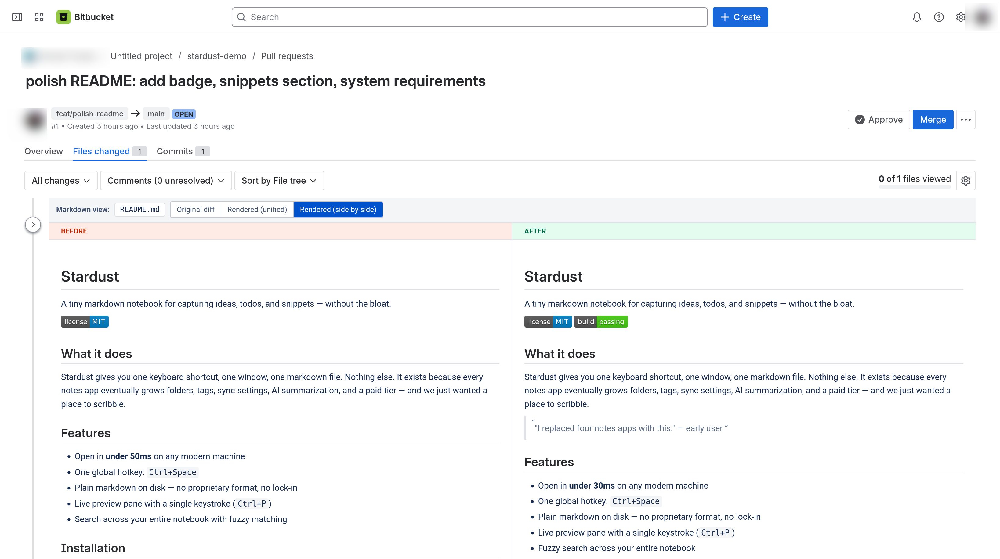

# Bitbucket Rich Diffs

A browser extension that renders Markdown files in Bitbucket Cloud pull-request diffs as proper formatted documents — unified or side-by-side — so reviewing prose, READMEs, and design docs stops feeling like reading a `+`/`-` log.

Works in **Firefox** and **Chrome** (and any Chromium-based browser that supports Chrome Web Store extensions).

## Install

[](https://addons.mozilla.org/en-US/firefox/addon/bitbucket-rich-diffs/)
[](#)

> **Firefox**: install from [addons.mozilla.org](https://addons.mozilla.org/en-US/firefox/addon/bitbucket-rich-diffs/) — pending Mozilla review on first listing.
>
> **Chrome**: link goes live after the first Chrome Web Store publish. Edit this URL once published.

After installing, open any Bitbucket Cloud pull request that touches a `.md` file — a small toolbar appears above each Markdown file with three view modes.

## See it in action

Each markdown file in a PR diff gets its own toolbar with three view modes you can switch between freely.

**Original diff** — Bitbucket's default view, untouched:



**Rendered (unified)** — the file rendered as actual Markdown, with added blocks tinted green and removed blocks tinted red and struck through, in document order:



**Rendered (side-by-side)** — two columns: Before on the left, After on the right, both fully rendered:



## Load locally for development

The repo's source layout is browser-agnostic; a small build script assembles per-browser loadable directories into `dist/`.

```bash
scripts/build.sh           # builds dist/firefox and dist/chrome
scripts/build.sh --zip     # also produces dist/<browser>.zip for stores
```

Then:

- **Firefox** — go to `about:debugging#/runtime/this-firefox`, click **Load Temporary Add-on…**, pick `dist/firefox/manifest.json`.
- **Chrome** — go to `chrome://extensions/`, enable **Developer mode**, click **Load unpacked**, select `dist/chrome/`.

After editing `src/`, re-run `scripts/build.sh` and reload in the browser.

## How it works

1. Content script runs on `*://bitbucket.org/*/pull-requests/*` pages.
2. It detects each file card on the diff page by looking for Bitbucket's per-file "Viewed" label, then finds the nearest enclosing card that contains diff hunks.
3. Filters to markdown filenames (`.md`, `.markdown`, `.mdx`, `.mkd`) and injects a toolbar.
4. On mode switch, it resolves the PR's source/destination commit hashes (via the same Bitbucket session you're already signed in with) and fetches the raw before/after content from `/raw/{commit}/{path}`.
5. Renders with [`marked`](https://github.com/markedjs/marked), sanitizes with [`DOMPurify`](https://github.com/cure53/DOMPurify), and computes a line-level diff with [`jsdiff`](https://github.com/kpdecker/jsdiff) for the unified-rendered view.

No data leaves your browser other than the file fetches that go to Bitbucket directly. No tracking, no analytics, no separate authentication. The same code runs in both Firefox and Chrome — only the manifest differs.

## Files

```
manifests/firefox.json   Firefox-specific MV3 manifest (background.scripts, gecko id)
manifests/chrome.json    Chrome-specific MV3 manifest (background.service_worker)
amo-metadata.json        AMO listing metadata used by the release pipeline
scripts/build.sh         Assembles dist/firefox and dist/chrome from the shared sources
src/content.js           Page detection, toolbar, fetch, mode switching
src/renderer.js          Markdown + diff rendering helpers
src/background.js        Privileged fetch handler (cross-browser onMessage)
src/styles.css           Toolbar + rendered output styling
lib/marked.min.js        Markdown parser (MIT, vendored)
lib/diff.min.js          Line-level diff (BSD-3, vendored, jsdiff)
lib/purify.min.js        HTML sanitizer (Apache-2.0/MPL-2.0, vendored, DOMPurify)
icons/                   Extension icons in 16, 32, 48, 96, 128 px sizes
screens/                 Screenshots used in this README and the store listings
```

## Releases

Tagging `v*` triggers a GitHub Actions workflow that builds per-browser packages (`scripts/build.sh --zip`), lints the Firefox build with `web-ext`, submits to AMO and the Chrome Web Store, and creates a GitHub release with both zips attached. See [`RELEASING.md`](RELEASING.md), and the per-store listing copy in [`AMO_LISTING.md`](AMO_LISTING.md) and [`CHROME_LISTING.md`](CHROME_LISTING.md).

## Known limitations

- Side-by-side renders the two columns independently rather than line-aligned — aligning rendered HTML to source lines reliably is more trouble than it's worth.
- The unified view renders each diff hunk separately, so a list item or fenced code block split across hunks may render slightly differently than the full document would.
- Only Markdown files are supported today. More file formats (CSV, ODS, JSON tree, etc.) are planned.

## License

MIT — see [`LICENSE`](LICENSE).
